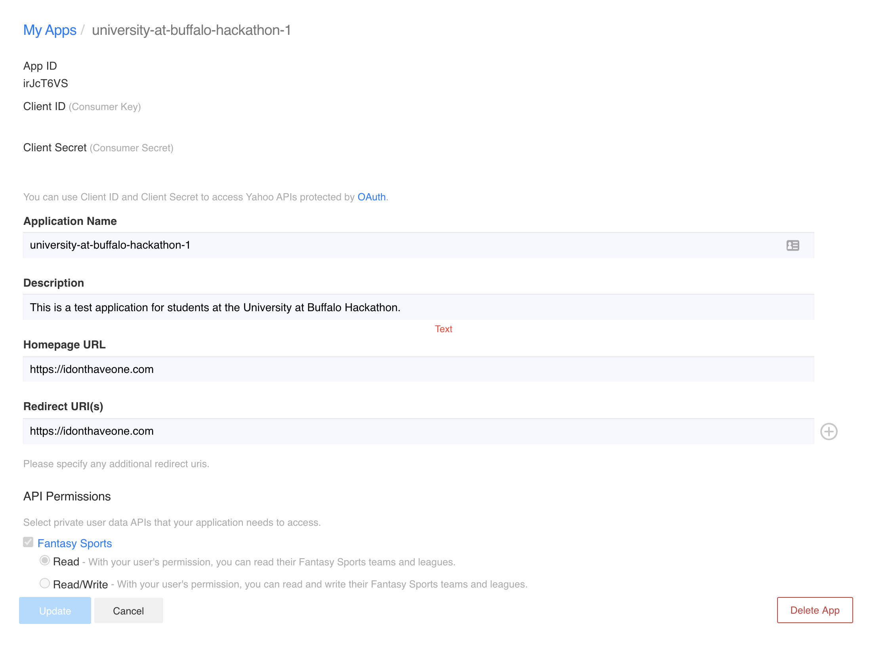
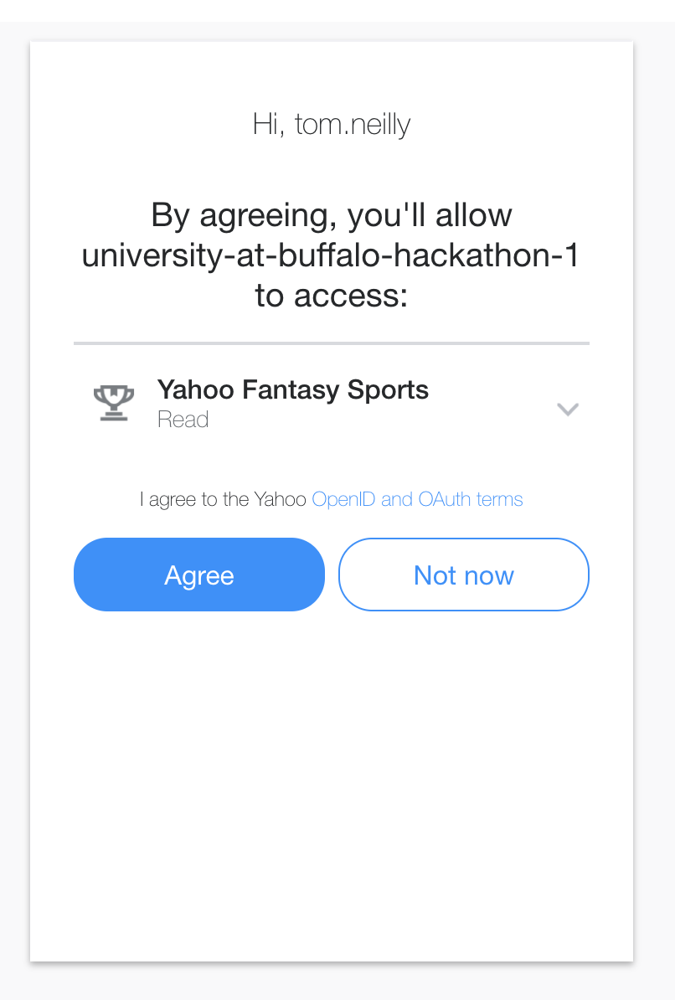
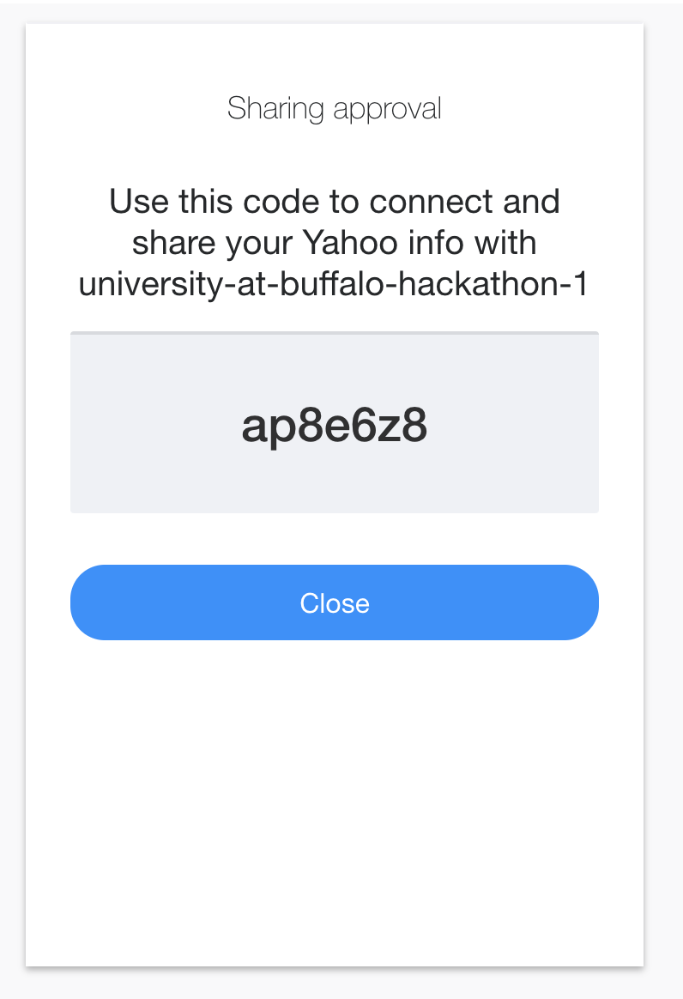

# Yahoo OAuth Helper

This is a simple tool to help a user register a Yahoo API application, obtain a client ID and secret, retrieve an oauth code, and generate oauth tokens for authorization against the Yahoo APIs.

## Getting Started

### Create an App
First thing's first, create an app by visiting this link:  
https://developer.yahoo.com/apps/create/

Upon app creation, you will be issued a Client ID (consumer key) and a Client Secret (consumer secret). In the photo below, these have been intentionally blanked out. Never share your secret with anyone else. 


### Retrieve an OAuth code
Retrieve a code for obtaining an OAuth token. This can ONLY be done via the browser. Using the example below, update the "client_id=" URL parameter and navigate to:  
https://api.login.yahoo.com/oauth2/request_auth?client_id=<INSERT-YOUR-CLIENT-ID-HERE>&redirect_uri=oob&response_type=code
   
As you are working on your app, if you need another code you can also use the tool:
`yahoo-oauth-helper get-code -id=<client_id>`




    
### Obtain an access token

Using your code, obtain an OAuth token. The token will get written to a file so that you can use it later for authorization to the Yahoo APIs:

```
yahoo-oauth-helper get-token \
    -id=<client_id> \
    -secret=<client_secret> \
    -code=ap8e6z8 \
    -file=/tmp/token
```

Now take a look at the contents of **/tmp/token**. You should notice there are 4 fields included:

- **access_token** - this is the actual token you will use for authorization to the Yahoo APIs. This token is sent in the form of an *Authorization* header (Authorization: Bearer <access_token>).
- **refresh_token** - This is a persistent token you can use to obtain a new access_token as needed. access_tokens only have a lifespan of 1 hour, so you will need to use the *refresh_token* periodically to obtain a new *access_token*.
- **expires_in** - This is how long the access_token is initially good for.
- **token_type** - The type of access_token.

### Refresh your access token

As the access_token used for the actual authorization only has a 1 hour lifespan, you will need to periodically refresh it. 

```
yahoo-oauth-helper refresh-token \
    -id=<client_id>> \
    -secret=<client_secret> \
    -file=<file where you previously stored your token>
```

Notice that the access_token value in the file has been updated with a newer one which is good for 1 hour.


### Using environment variables

Although all arguments can be passed via the command line, but if you'd like a more persistent set of arguments you can set these via environment variables.

```
export YAHOO_APP_CLIENT_ID=<client_id issued during app registration>  
export YAHOO_APP_CLIENT_SECRET=<client_secret issued during app registration>  
export YAHOO_APP_TOKEN_FILE=<file to write the token to>
```
