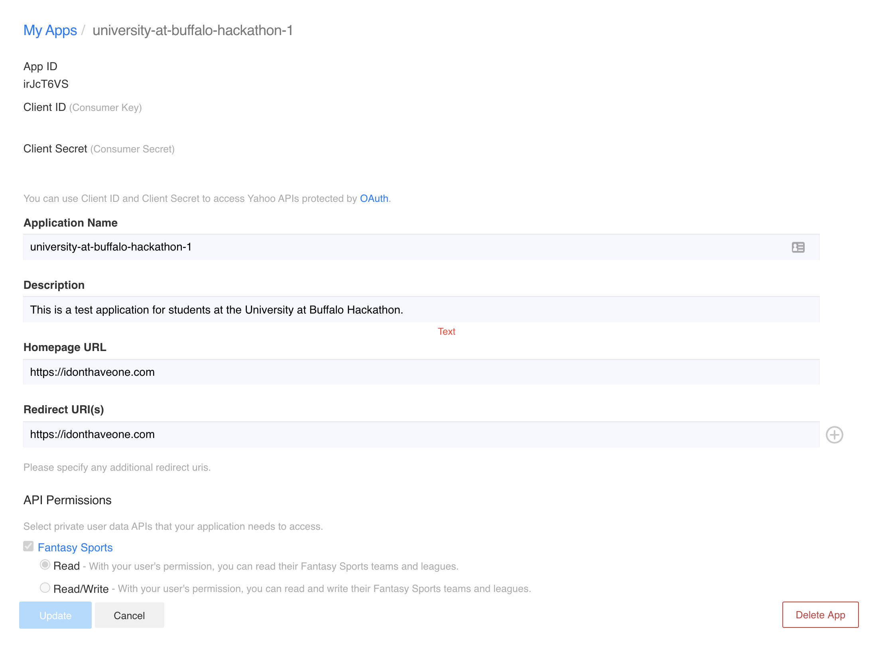
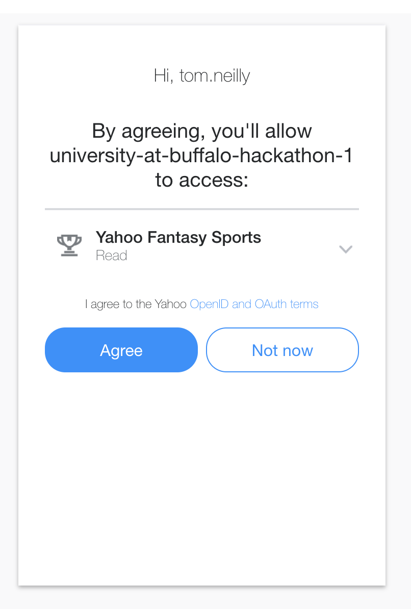
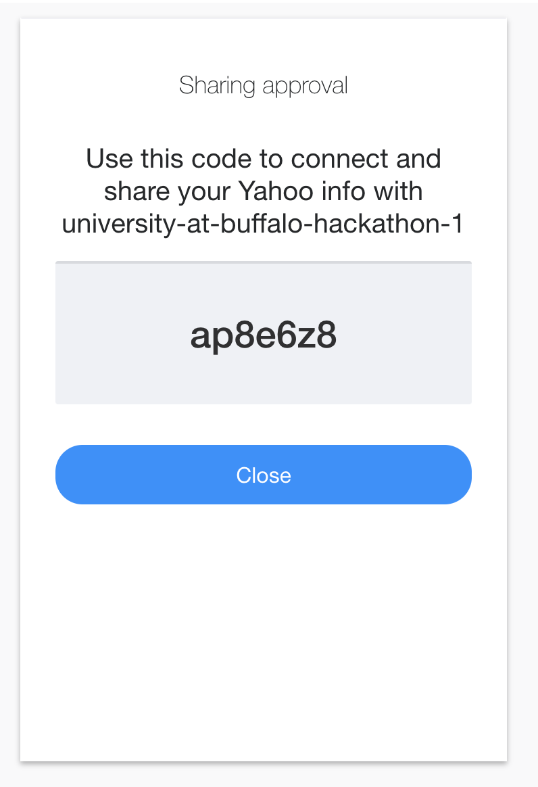

# Yahoo OAuth Helper

**\*\*This is not official Yahoo developer documentation. For official Yahoo developer documentation, please visit https://developer.yahoo.com/ where you can find lots of great resources around OAuth and specific API documentation.**

**yahoo-oauth-helper** is a simple tool to help a user register a Yahoo API application, obtain a client ID and secret, retrieve an oauth code, and generate oauth tokens for authorization against the Yahoo APIs. 

If nothing else, this should provide some frame of reference for how to obtain an OAuth token to be used for authorization on the Yahoo APIs.

## Getting Started

### Install Go

You'll first need to install Golang if it is not already, follow the official instructions here:  
https://golang.org/doc/install

### Install the yahoo-oauth-helper

Using the *go* command line tool, install the **yahoo-oauth-helper** tool.  
`go get github.com/neillyt/yahoo-sports-api-fun/yahoo-oauth-helper`

This will install the tool to wherever your GOPATH environment variable points to. Most likely it is either of these locations:
- /usr/local/go/bin/yahoo-oauth-helper
- ~/go/bin/yahoo-oauth-helper

### Create an App
First thing's first, create an app by visiting this link:  
https://developer.yahoo.com/apps/create/

Upon app creation, you will be issued a Client ID (consumer key) and a Client Secret (consumer secret). In the photo below, these have been intentionally blanked out. Never share your secret with anyone else. 


### Retrieve an OAuth code
Retrieve a code for obtaining an OAuth token. This can ONLY be done via the browser. Using the example below, update the "client_id=" URL parameter and navigate to:  
https://api.login.yahoo.com/oauth2/request_auth?client_id=<INSERT-YOUR-CLIENT-ID-HERE>&redirect_uri=oob&response_type=code
   
As you are working on your app, if you need another code you can also use the tool:
`yahoo-oauth-helper get-code -id=<client_id>`




    
### Obtain an access token

Using the code that was issued via the browser, and the credentials that were issued to you during the app creation, obtain an OAuth token. The token will get written to a file so that you can use it later for authorization to the Yahoo APIs:

```
yahoo-oauth-helper get-token \
    -id=<client_id issued on app creation> \
    -secret=<client_secret issued on app creation> \
    -code=<code issued via the browser> \
    -file=/tmp/token
```

Take a look at the contents of **/tmp/token**. You should notice there are 4 fields included:

- **access_token** - The actual token you will use for authorization to the Yahoo APIs. This token is sent in the form of an *Authorization* header (Authorization: Bearer <access_token>).
- **refresh_token** - A persistent token you can use to obtain a new access_token as needed. access_tokens only have a lifespan of 1 hour, so you will need to use the *refresh_token* periodically to obtain a new *access_token*.
- **expires_in** - How long the access_token is initially good for.
- **token_type** - Type of access_token.

### Refresh your access token

As the access_token used for the actual authorization only has a 1-hour lifespan, you will need to periodically refresh it. Using the credentials that were issued to you during the app creation, fill in the arguments accordingly:

```
yahoo-oauth-helper refresh-token \
    -id=<client_id issued on app creation> \
    -secret=<client_secret issued on app creation> \
    -file=<file where you previously stored your token>
```

Notice that the **access_token** value in the file has been updated with a newer one which is good for 1 hour.


### Using environment variables

Although all arguments can be passed via the command line, but if you'd like a more persistent set of arguments you can set these via environment variables.

```
export YAHOO_APP_CLIENT_ID=<client_id issued during app registration>  
export YAHOO_APP_CLIENT_SECRET=<client_secret issued during app registration>  
export YAHOO_APP_TOKEN_FILE=<file to write the token to>
```

# Now what?

You're probably thinking, "Well now I know how to get OAuth tokens, so what do I do with them?"